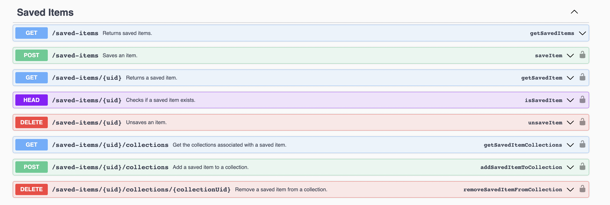

# Jambff API Client

A JavaScript OpenAPI client.

The API client is generated automatically from the
[OpenAPI specification](https://swagger.io/specification/) served by the
Jambff server.

**Table of Contents**

- [Installation](#installation)
- [Initialisation](#initialisation)
- [Usage](#usage)
- [Models](#models)
- [Authorization](#authorization)
- [Error handling](#error-handling)

## Installation

```sh
yarn add @jambff/client
```

## Initialisation

An API client can be created as follows:

```js
import { createJamBffClient } from '@jambff/client';

const jambff = createJamBffClient.create({
  env: 'staging',
  getAccessToken: () => 'my-access-token',
  refreshAccessToken: () => 'my-new-access-token',
  onError: console.error,
});
```

## Usage

The API client object exposes functions for each API operation. Each function is
called with an object containing the following properties:

### `params`

An object containing properties that are mapped to any named route parameters.
For example, if you have the route `/user/:name`, then the `name` property should
be passed in as `params: { name: 'Alex' }`.

### `query`

An object containing a property for each query string parameter.

### `data`

An object containing key-value to submit as the request body (i.e. for POST or PUT requests).

---

For example, given the following (simplified) OpenAPI specification:

```json
{
  "openapi": "3.0.1",
  "info": {
    "title": "{{title}}"
  },
  "paths": {
    "/example/{id}/get-stuff": {
      "get": {
        "operationId": "myExampleOperation",
        "parameters": [
          {
            "name": "id",
            "in": "path"
          },
          {
            "name": "limit",
            "in": "query"
          }
        ]
      }
    }
  }
}
```

When we run this code:

```js
import { createJamBffClient } from '@jambff/client';

const jambff = createJamBffClient({ env: 'staging' });

jambff.myExampleOperation({
  params: { id: 123 },
  query: { limit: 1 },
});
```

A request like this would be made:

```text
GET /example/123/get-stuff?limit=1
```

The OpenAPI docs generated for the Jambff API show the operation ID for each
endpoint on the right. For example, with the docs
shown below we would call `jambff.getSavedItems()` to make a request to the
`/saved-items` endpoint.



## Models

You can import TypeScript interfaces generated from the API server models via
`JamBffModels`, for example:

```ts
import { JamBffModels } from '@jambff/client';

const post: JamBffModels['Post'] = {
  title: 'My Post',
};
```

## Authorization

The API client supports JWT token-based authentication. Any access token
provided via the `getAccessToken()` function will be automatically attached to
requests that require it. If a request fails an attempt is made to refresh the
token by calling the `refreshAccessToken()` function and the request retried.
If the retry fails a 401 error will be thrown, at which point the consuming
application can handle this error as appropriate (e.g. redirect the user to sign
in again).

If an access token has expired an attempt will be made to refresh the token
before making the initial request, thus saving on unnecessary API calls.

For data available via GET endpoints of public APIs that is not
considered sensitive, if we were to send the `Authorization` header along with
every request then there is a risk that edge caches would effectively consider all
requests to be unique for each user, vastly lowering the cache hit rate
(especially true for applications where users must be logged in). Therefore, the
header will only be attached to requests when the Jambff API has marked up a
particular endpoint as requiring authentication
(see the [Jambff API docs](../api/README.md)).

## Error handling

Any HTTP errors encountered when using the client will be thrown as error object
that includes the following properties:

| Property     | Description                                             |
|--------------|---------------------------------------------------------|
| `statusCode` | The HTTP status code.                                   |
| `name`       | The name of the error.                                  |
| `message`    | An error message.                                       |
| `errors`     | An array containing any validation errors (see below).  |

If the request resulted in validation errors, such as a query parameter being
in the wrong format, then `errors` will include one or more objects with the
following properties:

| Property     | Description                                             |
|--------------|---------------------------------------------------------|
| `property`   | The name of the property that failed validation.        |
| `constraint` | The name of the constraint that failed.                 |
| `message`    | A message explaining why the constraint failed.         |

The `isJamBffError()` function can be used to determine if an error is a Jambff
error, for example:

```js
import { createJamBffClient, isJamBffError } from '@jambff/client';

const jambff = createJamBffClient({ env: 'staging' });

try {
  await jambff.myExampleOperation();
} catch(err) {
  if (isJamBffError(err)) {
    console.error(`HTTP Error: ${err.statusCode}`);

    return;
  }

  throw err;
}
```

Errors will be logged to the console. To implement custom error handling you
can pass an `onError()` callback when setting up the client.
